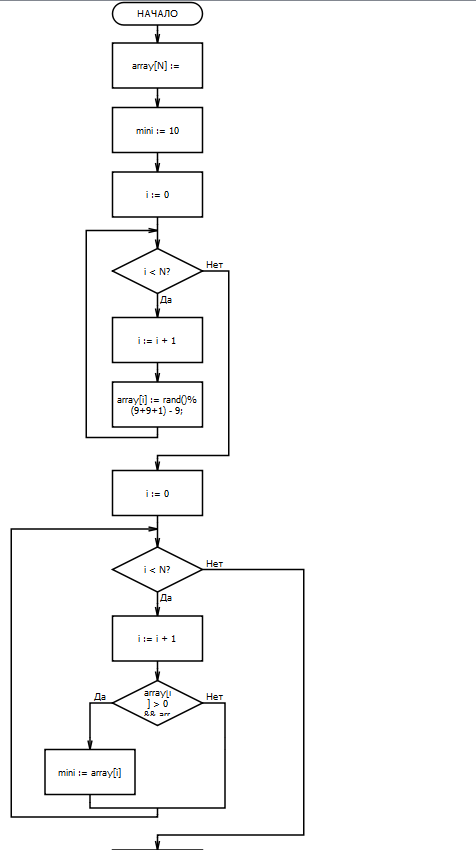
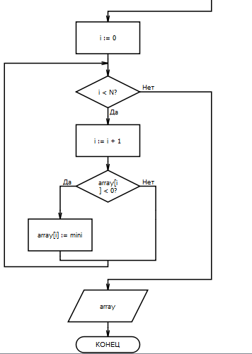
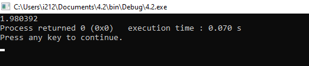

|

МИНОБРНАУКИ РОССИИ

|
| :-: |
|
Федеральное государственное бюджетное образовательное учреждение

высшего образования

**«МИРЭА – Российский технологический университет»**

**РТУ МИРЭА**
|
|Институт искусственного интеллекта|
|Кафедра Технологий Искусственного Интеллекта |

Практическая РАБОТА № 4

по дисциплине

«Процедурное программирование» 

Обучающийся: Погосян С. А. 

Группа: КВБО-07-23

Руководитель										*Яковлев Д. А*

Москва 2023

**Тема: «Массивы-фундаментальная структура данных. Обработка данных в массивах»** 

**Цель лабораторной работы:**

Целью данной лабораторной работы освоить на практике работу с массивами в языке Си.

**Описание работы:** 

- постановка задачи; 
- конструирование алгоритма решения задачи; 
- составление программы по разработанному алгоритму; 
- ввод в ЭВМ программы и исходных данных; 
- отладка и тестирование программы; 
- получение решения и анализ результатов. 

**Задание:** 

**Код программы:**

#define N 100

#include <stdio.h>

#include <stdlib.h>

int main()

{

`    `int array[N];

`    `int mini = 10;

`    `for (int i = 0; i < N; ++i) {

`        `array[i] = rand()%(9+9+1) - 9;

`    `}

`    `for (int i = 0; i < N; ++i) {

`        `if (array[i] > 0 && array[i] < mini) {

`            `mini = array[i];

`        `}

`    `}

`    `for (int i = 0; i < N; ++i) {

`        `if (array[i] < 0) {

`            `array[i] = mini;

`        `}

`    `}

`    `for (int i = 0; i < N; ++i) {

`        `printf("%d ", array[i]);

`    `}

}

**Алгоритм программы в виде блок-схемы:**

**Результат работы программы:** 

**Задание:**

**Код программы:** 

#define N 200

#include <stdio.h>

#include <stdlib.h>

int main()

{

`    `int array[N];

`    `int total\_ar[N];

`    `int k =0;

`    `int count = 0;

`    `int total = 0;

`    `for (int i =0; i < N; i++) {

`        `total\_ar[i] = 0;

`    `}

`    `for (int i = 0; i < N; ++i) {

`        `array[i] = rand()%(10+10+1) - 10;

`        `if (array[i] > 0) {

`            `total += 1;

`        `} else {

`            `if (total > 0) {

`                `count += 1;

`                `total\_ar[k] = total;

`                `total = 0;

`                `k += 1;

`            `}

`        `}

`    `}

`    `printf("\n%d\n", count);

`    `int t = 0;

`    `for (int i = 0; i < N; i++) {

`        `t += total\_ar[i];

`    `}

`    `double result = (double)t / count;

`    `printf("%lf", result);

`    `return 0;

}

**Алгоритм программы в виде блок  схем**

’ 

**Результат работы программы:** 

