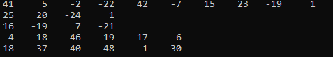
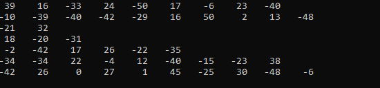
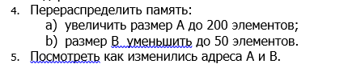
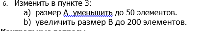

|

МИНОБРНАУКИ РОССИИ

|
| :-: |
|
Федеральное государственное бюджетное образовательное учреждение

высшего образования

**«МИРЭА – Российский технологический университет»**

**РТУ МИРЭА**
|
|Институт искусственного интеллекта|
|Кафедра  Технологий Искусственного Интеллекта|

Практическая работа № 8

по дисциплине

«Процедурное программирование» 

Обучающийся: Погосян С. А. 

Группа: КВБО-07-23

Руководитель										*Яковлев Д. А*

Москва 2023

**Тема: «Динамические массивы»** 

**Цель лабораторной работы:**

Целью данной лабораторной работы освоить на практике работу с динамическими массивами.

**Описание работы:** 

- Указатели. Типизированные указатели.
- Указатели и массивы.
- Адресная арифметика.
- Динамическое выделение памяти.
- Динамическое освобождение памяти

**Задание:** 

**Пример программы:** 

1. #include <stdio.h>
1. #include <stdlib.h>
1. ` `int main(void) {
1. `   `int \*\*ar;
1. `  `int i,j, n,\*mas;
1. `  `printf("Введите количество строк матрицы: ");
1. `  `scanf("%d", &n);
1. `  `ar = (int\*\*)malloc(n\*sizeof(int\*));
1. `  `mas = (int\*)malloc(n\*sizeof(int)); // массив кол-ва элементов строк
1. `  `// Ввод элементов массива
1. ` `for(i = 0; i<n; i++) {
1. `    `printf("Введите количество столбцов строки %d: ", i);
1. `    `scanf("%d", &mas[i]);//для i строки м.б.разные
1. `    `ar[i] = (int\*)malloc(mas[i]\*sizeof(int));
1. `    `for(j = 0; j<mas[i]; j++) {
1. `      `printf("ar[%d][%d]= ", i, j);
1. `      `scanf("%d", &ar[i][j]);
1. `    `}
1. `  `}
1. // Вывод элементов массива
1. `  `for(i=0; i<n; i++) { // цикл по строкам
1. `    `for(j=0; j<m; j++) { // цикл по столбцам  
1. `      `printf("%5d ", ar[i][j]); // 5 знакомест под элемент массива
1. `      `}
1. `    `printf("\n");
1. `    `free(ar[i]);   // освобождение памяти под строку
1. `   `}
1. ` `free(ar);
1. return 0;
1. }

**Измененный вариант:** 

#include <stdio.h>

#include <time.h>

#include <stdlib.h>

int main(void) {

`    `srand(time(NULL));

`    `int \*\*ar;

`    `int i,j, \*mas;

`    `int n = rand() % 10 + 1;

`    `ar = (int\*\*)malloc(n\*sizeof(int\*));

`    `mas = (int\*)malloc(n\*sizeof(int)); // массив кол-ва элементов строк

`    `// Ввод элементов массива

`    `for(i = 0; i<n; i++) {

`        `mas[i] = rand() % 10 + 1;

`        `ar[i] = (int\*)malloc(mas[i]\*sizeof(int));

`        `for(j = 0; j<mas[i]; j++) {

`            `ar[i][j] = rand() % (50+50+1) - 50;

`        `}

`    `}

`    `for(i=0; i<n; i++) {

`        `for(j=0; j<mas[i]; j++) {

`            `printf("%5d ", ar[i][j]);

`        `}

`        `printf("\n");

`        `free(ar[i]);

`        `}

`    `free(ar);

`    `return 0;

}

**Результат работы программы:** 

**Задание:** 

**Код программы:** 

#include <stdio.h>

#include <time.h>

#include <stdlib.h>

int main()

{

`    `int \*A, \*B;

`    `int i;

`    `int n\_A = 100;

`    `int n\_B = 100;

`    `A = (int\*)malloc(n\_A \* sizeof(int));

`    `B = (int\*)calloc(n\_B, sizeof(int));

`    `printf("Address of A = %p\n", &A);

`    `printf("Address of B = %p\n\n", &B);

`    `printf("A: \n\n");

`    `for (i = 0; i < n\_A; ++i) {

`        `printf("%d ", A[i]);

`    `}

`    `printf("\n\nB\n\n");

`    `for (i = 0; i < n\_B; ++i) {

`        `printf("%d ", B[i]);

`    `}

`    `free(A);

`    `free(B);

`    `return 0;

}

**Результат работы программы:** 

**Алгоритм в виде блок-схемы:** 

**Задание:** 

**Код программы:** 

#include <stdio.h>

#include <time.h>

#include <stdlib.h>

int main()

{

`    `int \*A, \*B;

`    `int i;

`    `int n\_A = 100;

`    `int n\_B = 100;

`    `A = (int\*)malloc(n\_A \* sizeof(int));

`    `B = (int\*)calloc(n\_B, sizeof(int));

`    `printf("Address of A = %p\n", &A);

`    `printf("Address of B = %p\n\n", &B);

`    `printf("A: \n\n");

`    `for (i = 0; i < n\_A; ++i) {

`        `printf("%d ", A[i]);

`    `}

`    `printf("\n\nB\n\n");

`    `for (i = 0; i < n\_B; ++i) {

`        `printf("%d ", B[i]);

`    `}

`    `printf("\n\n");

`    `A = realloc(A, sizeof(int) \* 200);

`    `B = realloc(B, sizeof(int) \* 50);

`    `for (i = 0; i < 200; ++i) {

`        `printf("%d ", A[i]);

`    `}

`    `printf("\n\nB\n\n");

`    `for (i = 0; i < 50; ++i) {

`        `printf("%d ", B[i]);

`    `}

`    `free(A);

`    `free(B);

`    `return 0;

}

**Результат работы программы:** 

**Адреса не поменялись**

**Задание:** 

**Код программы:** 

**#include <stdio.h>**

**#include <time.h>**

**#include <stdlib.h>**

**int main()**

**{**

`    `**int \*A, \*B;**

`    `**int i;**

`    `**int n\_A = 100;**

`    `**int n\_B = 100;**

`    `**A = (int\*)malloc(n\_A \* sizeof(int));**

`    `**B = (int\*)calloc(n\_B, sizeof(int));**

`    `**printf("Address of A = %p\n", &A);**

`    `**printf("Address of B = %p\n\n", &B);**

`    `**printf("A: \n\n");**

`    `**for (i = 0; i < n\_A; ++i) {**

`        `**printf("%d ", A[i]);**

`    `**}**

`    `**printf("\n\nB\n\n");**

`    `**for (i = 0; i < n\_B; ++i) {**

`        `**printf("%d ", B[i]);**

`    `**}**

`    `**printf("\n\n");**

`    `**A = realloc(A, sizeof(int) \* 50);**

`    `**B = realloc(B, sizeof(int) \* 200);**

`    `**for (i = 0; i < 50; ++i) {**

`        `**printf("%d ", A[i]);**

`    `**}**

`    `**printf("\n\nB\n\n");**

`    `**for (i = 0; i < 200; ++i) {**

`        `**printf("%d ", B[i]);**

`    `**}**

`    `**free(A);**

`    `**free(B);**

`    `**return 0;**

**}**

**Результат работы программы:** 

**Контрольные вопросы:** 

1. **Как организовать динамическое выделение памяти?**  

Память для массива целых чисел в нашей работе не выделяется на этапе компиляции, так что нам достаточно объявить в программе только переменную - указатель на начало массива:

\*\*ar 

-указатель на начало массива строк \* mas

`     `Размерность массива определяется при выполнении программы, так что для ее сохранения нужна только  одна переменная:

n

Элементы массива будут храниться в динамической памяти  (куча), поэтому по окончании работы память занятую указателями необходимо освободить.

1. **Почему необходимо избегать утечки памяти?**  

Утечка является проблемой, так как она блокирует ресурсы памяти, что со временем приводит к ухудшению производительности системы.

1. **В чем разница между функциями malloc() и calloc()?**

Функция malloc() выделяет область памяти заданного размера и возвращает указатель на эту область. Функция calloc() выделяет область памяти заданного размера и заполняет ее нулями.

1. **Смысл использования free()?**

Освобождение памяти из кучи

1. **Смысл работы функции realloc()?**

Функция realloc выполняет перераспределение блоков памяти.
Размер блока памяти, на который ссылается параметр ptrmem изменяется на size байтов. Блок памяти может уменьшаться или увеличиваться в размере.

1. **Основные преимущества динамического выделения памяти?**

Контроль памяти**,** c помощью динамического выделения памяти под указатели строк можно размещать свободные массивы. Свободным называется двухмерный массив (матрица), размер строк которого может быть различным.

